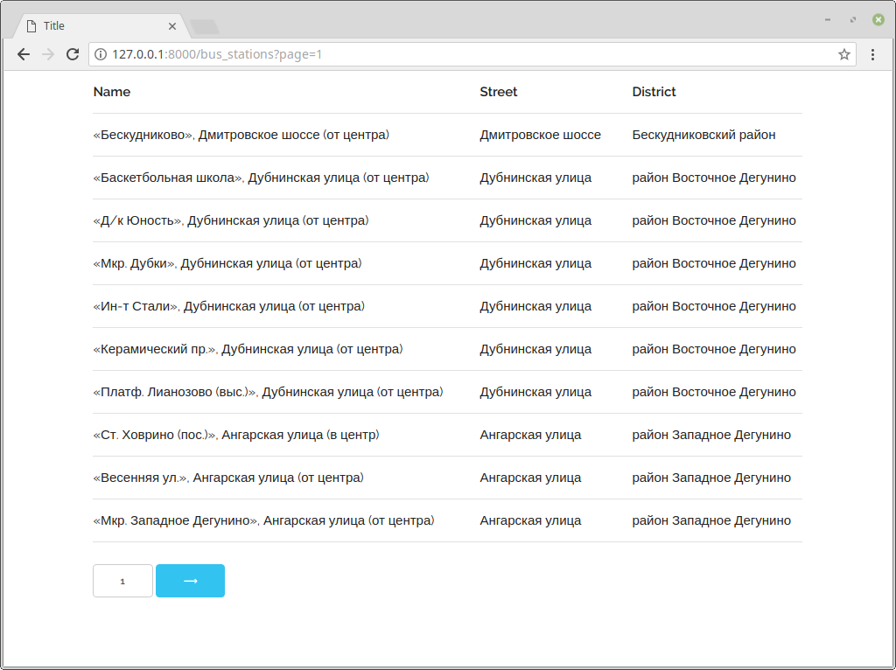

# Пагинация

## Задание

Реализуйте пагинацию по csv-файлу с [портала открытых данных](https://data.mos.ru/datasets/752), содержащего список остановок наземного общественного транспорта.

Для этого необходимо реализовать функцию отображение `stations.views.bus_stations`, формируя контекст, как показано в примере.

Путь к файлу хранится в настройках `settings.BUS_STATION_CSV`.

Для чтения csv-файла можете использовать [DictReader](https://docs.python.org/3/library/csv.html#csv.DictReader) и учтите, что файл в кодировке `utf-8`.



## Документация по проекту

Для запуска проекта необходимо

Установить зависимости:

```bash
pip install -r requirements.txt
```

- Выполните команды:

Первый запуск создается базу данных. Следующий запуск вносит изменения сравнивая с текущим состоянием.

```bash
python manage.py migrate
```

Выполните запуск проекта:

```bash
python manage.py runserver
```

Перейти по адресу:

http://127.0.0.1:8000/
